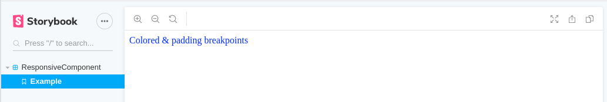

## styled-system@4.2.4

Install:

``` bash
npm i
```

Run storybook:
```
npm run storybook
```

Check the aspect **does change** when the size of the viewport changes:

#### less than 512px viewport

#### less than 768px viewport

#### less than 1024px viewport


## styled-system@5.1.5

Change to the branch which uses `styled-system@5.1.5`:


``` bash
git checkout ss5
```

Install:
``` javascript
npm i
```

Run storybook:
```
npm run storybook
```

Check the aspect **does not change** when the size of the viewport changes:

#### less than 512px viewport

#### less than 768px viewport

#### less than 1024px viewport

